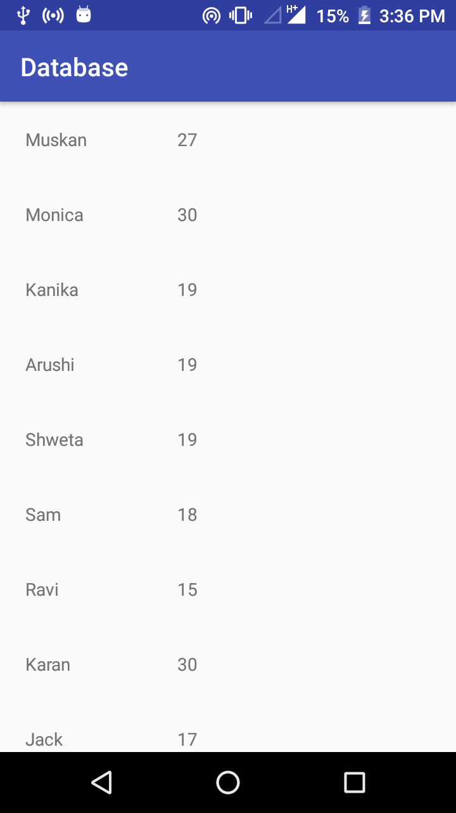

# Database
Data is initially represented through recycler view.This data is hardcoded into array list.Then it is linked through firebase and data from firebase is uploaded into app.
Any changes in the database of app will be reflected in realtime in the app.
## Image

